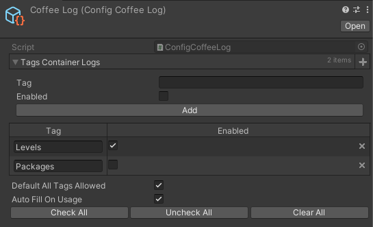

# Logger Pro

## Introduction

Логгирование в проекте осуществляется с помощью статического класса `ProLogger`. В редакторе
удобно отсматривать логи с помощью Console Pro (`Window/Console Pro 3`).
Она позволяет разделять логи по тегам.

## Config

Создать конфиг логгера можно через `LoggerPro/Config`.

## API

Рекомендованные методы для работы с логом:

- `TagLog(string tag, string value)`

  Логгирование обычной строки по тегу.

- `TagLog(string tag, params object[] values)`

  Логгирование конкатенированной из объектов строки по тегу.

- `FastTagLog(string value)`

  Логгирование по тегу "fastlog".

- `FastTagLog(params object[] values)`

  Логгирование конкатенированной из объектов строки по тегу "fastlog".

- `ForceTagLog(string tag, string value)`

  Логгирование форсом, в обход конфига логгера.

- `Pretty(object value)`

  Преобразование объекта в строку формата JSON с отступами.

- `Warning(string value)`

  Обертка над `Debug.LogWarning`.

- `Error(string value)`

  Обертка над `Debug.LogError`.

- `Error(Exception e)`

  Обертка над `Debug.LogError`.

## Profling Tool

В пакет включена тулза для профайлинга с помощью disposable секции.

Используйте `using (ProfilingTool.StartSection(string message, string tag)) {}`, чтобы измерить выполнение блока кода и
вывести количество затраченных мс по тегу.